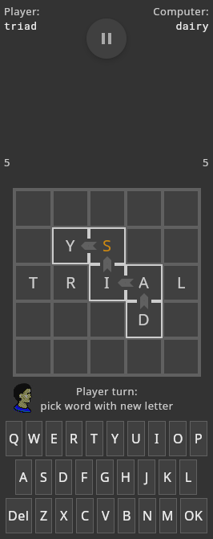
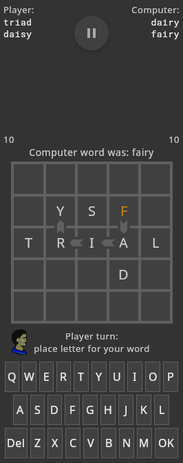
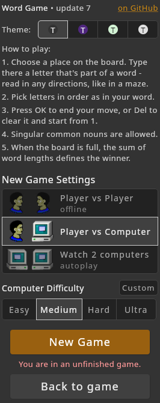

# Word Game

A language puzzle. 

1. Choose a place on the board. Type there a letter that's part of a word - read in any directions, like in a maze.
2. Pick letters in order as in your word, except diagonally.
3. Press OK to end your move, or Del to clear it and start from 1.
4. Singular common nouns are allowed.
5. When the board is full, the sum of word lengths defines the winner.

[](example/example_1.png)
[](example/example_2.png)
[](example/example_3.png)


## Example:

Starting with a random initial word:
```
Player 1:  +---+---+---+---+---+  Player 2:
           |   |   |   |   |   |
           +---+---+---+---+---+
           |   |   |   |   |   |
           +---+---+---+---+---+
           | S | N | A | K | E |
           +---+---+---+---+---+
           |   |   |   |   |   |
           +---+---+---+---+---+
           |   |   |   |   |   |
           +---+---+---+---+---+
```

Player 1 places `p` for `snap`, arrows show the directions of reading:
```
Player 1:  +---+---+---+---+---+  Player 2:
snap       |   |   |   |   |   |
           +---+---+---+---+---+
           |   |   | P |   |   |
           +---+---+-^-+---+---+
           | S > N > A | K | E |
           +---+---+---+---+---+
           |   |   |   |   |   |
           +---+---+---+---+---+
           |   |   |   |   |   |
           +---+---+---+---+---+
```

Player 2 places `s` for `span`:
```
Player 1:  +---+---+---+---+---+  Player 2:
snap       |   |   |   |   |   |  span
           +---+---+---+---+---+
           |   |   | P < S |   |
           +---+---+-v-+---+---+
           | S | N < A | K | E |
           +---+---+---+---+---+
           |   |   |   |   |   |
           +---+---+---+---+---+
           |   |   |   |   |   |
           +---+---+---+---+---+
```

<details>
<summary>See the rest of this game.</summary>

Player 1 places `m` for `spam`:
```
Player 1:  +---+---+---+---+---+  Player 2:
snap       |   |   |   |   |   |  span
spam       +---+---+---+---+---+
           |   |   | P < S |   |
           +---+---+-v-+---+---+
           | S | N | A | K | E |
           +---+---+-v-+---+---+
           |   |   | M |   |   |
           +---+---+---+---+---+
           |   |   |   |   |   |
           +---+---+---+---+---+
```

Player 2 places `r` for `maker`:
```
Player 1:  +---+---+---+---+---+  Player 2:
snap       |   |   |   |   |   |  span
spam       +---+---+---+---+---+  maker
           |   |   | P | S |   |
           +---+---+---+---+---+
           | S | N | A > K > E |
           +---+---+-^-+---+-v-+
           |   |   | M |   | R |
           +---+---+---+---+---+
           |   |   |   |   |   |
           +---+---+---+---+---+
```

Player 1 places `i` for `mire`:
```
Player 1:  +---+---+---+---+---+  Player 2:
snap       |   |   |   |   |   |  span
spam       +---+---+---+---+---+  maker
mire       |   |   | P | S |   |
           +---+---+---+---+---+
           | S | N | A | K | E |
           +---+---+---+---+-^-+
           |   |   | M > I > R |
           +---+---+---+---+---+
           |   |   |   |   |   |
           +---+---+---+---+---+
```

Player 2 places `e` for `name`:
```
Player 1:  +---+---+---+---+---+  Player 2:
snap       |   |   |   |   |   |  span
spam       +---+---+---+---+---+  maker
mire       |   |   | P | S |   |  name
           +---+---+---+---+---+
           | S | N > A | K | E |
           +---+---+-v-+---+---+
           |   |   | M | I | R |
           +---+---+-v-+---+---+
           |   |   | E |   |   |
           +---+---+---+---+---+
```

Player 1 places `t` for `kite`:
```
Player 1:  +---+---+---+---+---+  Player 2:
snap       |   |   |   |   |   |  span
spam       +---+---+---+---+---+  maker
mire       |   |   | P | S |   |  name
kite       +---+---+---+---+---+
           | S | N | A | K | E |
           +---+---+---+-v-+---+
           |   |   | M | I | R |
           +---+---+---+-v-+---+
           |   |   | E < T |   |
           +---+---+---+---+---+
```

Player 2 places `m` for `item`:
```
Player 1:  +---+---+---+---+---+  Player 2:
snap       |   |   |   |   |   |  span
spam       +---+---+---+---+---+  maker
mire       |   |   | P | S |   |  name
kite       +---+---+---+---+---+  item
           | S | N | A | K | E |
           +---+---+---+---+---+
           |   |   | M | I | R |
           +---+---+---+-v-+---+
           |   | M < E < T |   |
           +---+---+---+---+---+
```

Player 1 places `e` for `meme`:
```
Player 1:  +---+---+---+---+---+  Player 2:
snap       |   |   |   |   |   |  span
spam       +---+---+---+---+---+  maker
mire       |   |   | P | S |   |  name
kite       +---+---+---+---+---+  item
meme       | S | N | A | K | E |
           +---+---+---+---+---+
           |   | E > M | I | R |
           +---+-^-+-v-+---+---+
           |   | M | E | T |   |
           +---+---+---+---+---+
```

Player 2 places `o` for `memo`:
```
Player 1:  +---+---+---+---+---+  Player 2:
snap       |   |   |   |   |   |  span
spam       +---+---+---+---+---+  maker
mire       |   |   | P | S |   |  name
kite       +---+---+---+---+---+  item
meme       | S | N | A | K | E |  memo
           +---+---+---+---+---+
           |   | E | M | I | R |
           +---+---+-v-+---+---+
           | O < M < E | T |   |
           +---+---+---+---+---+
```

Player 1 places `c` for `comet`:
```
Player 1:  +---+---+---+---+---+  Player 2:
snap       |   |   |   |   |   |  span
spam       +---+---+---+---+---+  maker
mire       |   |   | P | S |   |  name
kite       +---+---+---+---+---+  item
meme       | S | N | A | K | E |  memo
comet      +---+---+---+---+---+
           | C | E | M | I | R |
           +-v-+---+---+---+---+
           | O > M > E > T |   |
           +---+---+---+---+---+
```

Player 2 places `t` for `scent`:
```
Player 1:  +---+---+---+---+---+  Player 2:
snap       |   |   |   |   |   |  span
spam       +---+---+---+---+---+  maker
mire       |   | T | P | S |   |  name
kite       +---+-^-+---+---+---+  item
meme       | S | N | A | K | E |  memo
comet      +-v-+-^-+---+---+---+  scent
           | C > E | M | I | R |
           +---+---+---+---+---+
           | O | M | E | T |   |
           +---+---+---+---+---+
```

Player 1 places `a` for `ascent`:
```
Player 1:  +---+---+---+---+---+  Player 2:
snap       |   |   |   |   |   |  span
spam       +---+---+---+---+---+  maker
mire       | A | T | P | S |   |  name
kite       +-v-+-^-+---+---+---+  item
meme       | S | N | A | K | E |  memo
comet      +-v-+-^-+---+---+---+  scent
ascent     | C > E | M | I | R |
           +---+---+---+---+---+
           | O | M | E | T |   |
           +---+---+---+---+---+
```

Player 2 places `e` for `tire`:
```
Player 1:  +---+---+---+---+---+  Player 2:
snap       |   |   |   |   |   |  span
spam       +---+---+---+---+---+  maker
mire       | A | T | P | S |   |  name
kite       +---+---+---+---+---+  item
meme       | S | N | A | K | E |  memo
comet      +---+---+---+---+---+  scent
ascent     | C | E | M | I > R |  tire
           +---+---+---+-^-+-v-+
           | O | M | E | T | E |
           +---+---+---+---+---+
```

Player 1 places `m` for `merit`:
```
Player 1:  +---+---+---+---+---+  Player 2:
snap       |   |   |   |   |   |  span
spam       +---+---+---+---+---+  maker
mire       | A | T | P | S | M |  name
kite       +---+---+---+---+-v-+  item
meme       | S | N | A | K | E |  memo
comet      +---+---+---+---+-v-+  scent
ascent     | C | E | M | I < R |  tire
merit      +---+---+---+-v-+---+
           | O | M | E | T | E |
           +---+---+---+---+---+
```

Player 2 places `a` for `asker`:
```
Player 1:  +---+---+---+---+---+  Player 2:
snap       |   |   |   | A |   |  span
spam       +---+---+---+-v-+---+  maker
mire       | A | T | P | S | M |  name
kite       +---+---+---+-v-+---+  item
meme       | S | N | A | K > E |  memo
comet      +---+---+---+---+-v-+  scent
ascent     | C | E | M | I | R |  tire
merit      +---+---+---+---+---+  asker
           | O | M | E | T | E |
           +---+---+---+---+---+
```

Player 1 places `w` for `wasp`:
```
Player 1:  +---+---+---+---+---+  Player 2:
snap       |   |   |   | A < W |  span
spam       +---+---+---+-v-+---+  maker
mire       | A | T | P < S | M |  name
kite       +---+---+---+---+---+  item
meme       | S | N | A | K | E |  memo
comet      +---+---+---+---+---+  scent
ascent     | C | E | M | I | R |  tire
merit      +---+---+---+---+---+  asker
wasp       | O | M | E | T | E |
           +---+---+---+---+---+
```

Player 2 places `m` for `mask`:
```
Player 1:  +---+---+---+---+---+  Player 2:
snap       |   |   | M > A | W |  span
spam       +---+---+---+-v-+---+  maker
mire       | A | T | P | S | M |  name
kite       +---+---+---+-v-+---+  item
meme       | S | N | A | K | E |  memo
comet      +---+---+---+---+---+  scent
ascent     | C | E | M | I | R |  tire
merit      +---+---+---+---+---+  asker
wasp       | O | M | E | T | E |  mask
           +---+---+---+---+---+
```

Player 1 places `o` for `atom`:
```
Player 1:  +---+---+---+---+---+  Player 2:
snap       |   | O > M | A | W |  span
spam       +---+-^-+---+---+---+  maker
mire       | A > T | P | S | M |  name
kite       +---+---+---+---+---+  item
meme       | S | N | A | K | E |  memo
comet      +---+---+---+---+---+  scent
ascent     | C | E | M | I | R |  tire
merit      +---+---+---+---+---+  asker
wasp       | O | M | E | T | E |  mask
atom       +---+---+---+---+---+
```

Player 2 places `b` for `sabot`:
```
Player 1:  +---+---+---+---+---+  Player 2:
snap       | B > O | M | A | W |  span
spam       +-^-+-v-+---+---+---+  maker
mire       | A | T | P | S | M |  name
kite       +-^-+---+---+---+---+  item
meme       | S | N | A | K | E |  memo
comet      +---+---+---+---+---+  scent
ascent     | C | E | M | I | R |  tire
merit      +---+---+---+---+---+  asker
wasp       | O | M | E | T | E |  mask
atom       +---+---+---+---+---+  sabot
```


The board is full, the game is over. Total words length is
```
Player 1: 44
Player 2: 44
```

It's a draw.

</details>


## Build, run, play

Get source code for all target platforms below:
```
git clone https://github.com/alex-vt/WordGame.git
cd WordGame
```

### Android

Requirements: Java, Android SDK

Signing setup:
* Put your `keystore.jks` to the project's root folder for signing the app.
* Create a `signing.properties` in the project's root folder with `keystore.jks` credentials:
```
signingStoreLocation=../keystore.jks
signingStorePassword=<keystore.jks password>
signingKeyAlias=<keystore.jks alias>
signingKeyPassword=<keystore.jks key password>
```
#### Run on ADB connected device:
```
./gradlew installRelease
```

#### Build installable APK
```
./gradlew assembleRelease
```
Install `build/outputs/apk/release/WordGame-release.apk` on Android device.


### Desktop Linux

Requirements: Java

#### Run on desktop:
```
./gradlew run
```

#### Build executable:
```
./gradlew createDistributable
```
Folder with the game will be `build/compose/binaries/main/app/WordGame`.

To run the game, in the game folder execute `bin/WordGame`

### Browser version

_Note: this is experimental._

Requirements: Java

#### Run in browser:
```
./gradlew jsBrowserRun
```

#### Build deployable:
```
./gradlew jsBrowserExecutableDistribution
```
Folder with the game will be `build/developmentExecutable`.

To play in browser, host the game folder contents, for example on GitHub Pages.

##### Play online

The deployable game folder contents hosted on GitHub Pages of user `alex-vt` in `wordgame` folder is playable on https://alex-vt.github.io/wordgame.


## Development

Tech keywords: Kotlin, Gradle, Jetpack Compose Multiplatform

Target platforms: Android, Desktop, JS/Web/Browser


## License

[MIT License](LICENSE)
